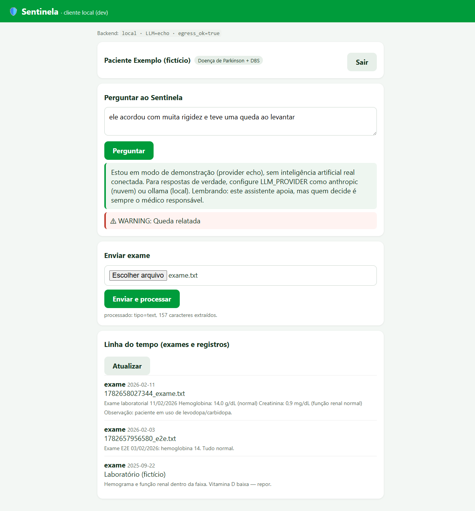

# 🛡️ Neurosint

**Um copiloto de IA para a família e o médico cuidarem melhor de quem você ama.**

[](LICENSE)
[](CHANGELOG.md)
[](DISCLAIMER.md)
[](README.md) [](README.en.md)

> **O Neurosint é um copiloto para a família e o médico.** Ele organiza e cruza anos de dados
> de saúde para apoiar as decisões do profissional e o cuidado no dia a dia — quem decide é
> sempre o médico. (Não substitui avaliação médica; detalhes em [DISCLAIMER.md](DISCLAIMER.md).)

---

## A história

Meu pai tem Doença de Parkinson e um estimulador cerebral profundo (DBS). Ao longo de uma
década, acumulamos centenas de exames, laudos, transcrições de consulta e imagens — espalhados
em CDs, PDFs e pastas. Numa consulta de vinte minutos, nenhum médico consegue cruzar tudo isso.

Então montei um sistema: um **conselho de agentes de IA** que lê todos os dados, organiza a
linha do tempo, cruza marcadores ao longo dos anos e prepara perguntas para a próxima consulta.
Uma ferramenta de fusão de imagens ajudou a visualizar o posicionamento dos eletrodos do DBS —
e a conversa que isso permitiu com o neurologista levou a um achado importante (um eletrodo
cerca de **7,1 mm fora do alvo motor**). Um assistente de WhatsApp passou a registrar remédio,
tremor e marcha no dia a dia, e a gerar relatórios para levar ao médico.

**A IA não diagnosticou, não prescreveu, não reprogramou nada. Os médicos fizeram.**
Eu só reduzi a distância entre os dados e a decisão.

Este repositório é esse sistema, **transformado em template** — sem nenhum dado do meu pai e
sem nenhuma credencial — para que outra pessoa cuidando de um familiar possa ter a mesma alavanca.
A jornada completa está em **[docs/JORNADA.pdf](docs/JORNADA.pdf)**.

## O que ele faz

- **Organiza e cruza** anos de exames, laudos e consultas em texto pesquisável.
- **Prepara** análises e briefings que o médico lê em minutos — e perguntas para a consulta.
- **Acompanha** o dia a dia (remédio, sintomas, marcha) e sinaliza o que merece atenção.

É um copiloto, honesto sobre os limites da IA (que pode errar e alucinar): o diagnóstico, a
prescrição e os ajustes são sempre do médico. Veja os [limites e avisos](DISCLAIMER.md).

## As 4 camadas (comece pela Camada 0)

Cada camada agrega valor sozinha; a fricção cresce conforme você desce.

```
Camada 0 ─ Conselho de agentes        → só precisa do Claude Code            (fricção: mínima)
Camada 1 ─ Organização de exames      → convenção de pastas + texto          (fricção: baixa)
Camada 2 ─ Fusão de imagens do DBS     → Python + SimpleITK                   (fricção: média)
Camada 3 ─ Busca de evidência (MCP)    → instalar servidores MCP              (fricção: média)
Camada 4 ─ Assistente de WhatsApp      → Supabase + WhatsApp + Cloud Run      (fricção: alta)
```

Detalhes em **[docs/ARQUITETURA.md](docs/ARQUITETURA.md)**.

## Começo rápido (< 10 min — Camada 0)

```bash
git clone https://github.com/michelzf/neurosint
cd neurosint

# 1) Instale o Claude Code (https://claude.com/claude-code)
# 2) Os agentes já estão em .claude/commands/ — rode contra o caso fictício:
#    abra o Claude Code nesta pasta e experimente:
#       /laboratorio   → detecta tendências nos exames fictícios
#       /dbs           → comenta a configuração de DBS fictícia
#       /preparar-consulta → monta um briefing a partir da consulta fictícia
```

Tudo em `exemplo-caso-ficticio/` é **inventado** — serve para você ver o fluxo sem usar dados
reais. Quando estiver confortável, copie o template (`cp CLAUDE.template.md CLAUDE.md`),
preencha-o, e organize os dados do **seu** familiar (que ficam **só na sua máquina** — ver `.gitignore`).

## Instalação por camada

Passo a passo de cada camada em **[docs/INSTALACAO.md](docs/INSTALACAO.md)**.

## Nuvem vs. local / privacidade

O padrão é **nuvem** (Claude/Claude Code; e, na Camada 4, Anthropic/OpenAI/ElevenLabs) — foi
onde o sistema foi afinado. Há um **modo local experimental** (Ollama / whisper.cpp) para quem
prioriza privacidade total. O trade-off é honesto: modelos locais pequenos não igualam o
raciocínio clínico dos modelos de fronteira. Detalhes em **[docs/PRIVACIDADE.md](docs/PRIVACIDADE.md)**.

> **Produto (em construção):** uma versão "app + servidor" 100% Supabase, multi-família, está
> sendo montada em `supabase/` (backend) — plano em **[docs/PLANO_PRODUTO.md](docs/PLANO_PRODUTO.md)**.
> Ela roda em **dois modos** (100% local com guard anti-egress, ou servidor), escolhidos só por
> variável de ambiente — ver **[docs/EXECUCAO.md](docs/EXECUCAO.md)**.



> A tela acima é o app rodando contra o **caso fictício** em modo `echo` — sem IA real e sem
> nada sair da máquina. É o que você vê seguindo o [docs/EXECUCAO.md](docs/EXECUCAO.md).

## Estrutura do repositório

```
neurosint/
├── .claude/commands/        # Camada 0 — 9 agentes como slash commands (/neurologista…)
├── .claude/agents/          # Camada 0 — 6 subagents especialistas (fan-out em paralelo)
├── CLAUDE.template.md        # template de instruções do projeto (→ copie p/ CLAUDE.md)
├── protocolos/              # protocolos (ex.: varredura visual inicial)
├── exemplo-caso-ficticio/   # caso 100% fictício para demonstração
├── exames/                  # Camada 1 — convenção (seus dados ficam só aqui, gitignored)
├── tools/dbs_fusion/        # Camada 2 — fusão DICOM (Python)
├── tools/check-pii.sh       # guarda-corpo anti-PII (+ .gitleaks.toml, .pre-commit-config.yaml)
├── .mcp.json.example        # Camada 3 — config dos MCPs de evidência
├── assistant/               # Camada 4 — assistente de WhatsApp (Node.js → Cloud Run)
├── supabase/                # Produto (preview) — backend 100% Supabase: migrations, RLS, Edge Functions
├── apps/mobile/             # Produto (preview) — app Expo/React Native (cliente do backend)
├── packages/shared/         # Produto (preview) — código compartilhado (em construção)
├── workers/                 # Produto (preview) — jobs assíncronos (em construção)
├── tools/devkit/            # Harness de dev/teste local do produto (Deno + Playwright)
└── docs/                    # jornada, arquitetura, privacidade, instalação, execução, plano
```

## Contribuir · Segurança · Licença

- Como contribuir: **[CONTRIBUTING.md](CONTRIBUTING.md)** · Conduta: **[CODE_OF_CONDUCT.md](CODE_OF_CONDUCT.md)**
- Segurança e como reportar (e **nunca** commitar dado real): **[SECURITY.md](SECURITY.md)**
- Licença: **[AGPL-3.0-or-later](LICENSE)** — quem oferecer como serviço precisa abrir o código.

## Agradecimentos

Ao meu pai. E a todos os médicos que fizeram o trabalho de verdade — este sistema só os ajudou
a enxergar mais rápido o que os dados já diziam.

> *"A IA não diagnosticou, não prescreveu, não reprogramou. Os médicos fizeram. Eu só reduzi a
> distância entre os dados e a decisão."*
