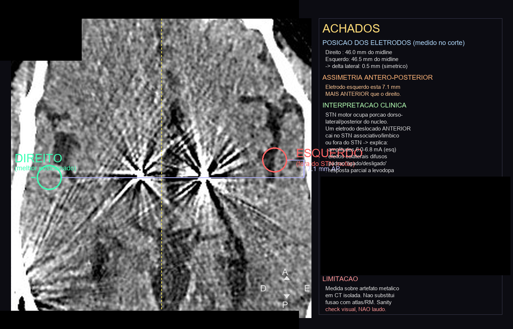

# A jornada — 7,1 milímetros

> A história real (anonimizada) que deu origem ao Neurosint. Sobre o meu pai — sem nome,
> sem dados de identificação. Nada aqui é conselho médico; ver [DISCLAIMER.md](../DISCLAIMER.md).

---

## 7,1 milímetros

Esse é o quanto o eletrodo no cérebro do meu pai ficou fora do alvo — desde a cirurgia, anos atrás.

Meu pai tem Parkinson. Anos atrás, fez uma cirurgia de estimulação cerebral profunda (DBS):
basicamente um marca-passo instalado no cérebro. **Por seis anos, ninguém notou** que o
eletrodo esquerdo tinha sido posicionado fora do ponto certo.

Eu trabalho com tecnologia e estudo IA aplicada desde 2022 — sistemas multi-agente, RAG,
memória semântica em produção. Não sou médico. Não tenho doutorado. Nada disso me preparou
para o que vou contar.

## A virada

Praia, família reunida. Meu pai travou. Tremor, rigidez total, olhando pra gente sem
responder. Eu tinha o controle remoto do estimulador na mão. Desliguei. Esperei. Religuei.
Ele voltou a se mexer.

Levei ao médico. A resposta foi: *"isso é progressão da doença. Você tem que aceitar a
condição do seu pai."*

Aceitar.

## O que eu fiz em vez de aceitar

Naquela semana comecei a estudar Parkinson e neuroestimuladores a fundo. E fiz duas coisas:

1. **Construí um assistente de WhatsApp** que conversa com meus pais todo dia e registra
   remédio, tremor, marcha e o programa ativo do estimulador. Em dois meses, juntei uma base
   de dados que nenhum médico teria como acumular sozinho — porque a consulta vê um instante,
   e o dia a dia vê o padrão.

2. **Organizei mais de 50 exames**, de cerca de uma década. Cada PDF passado por OCR, cada laudo
   virando texto pesquisável. Uma década de história clínica, finalmente cruzável.

Aí montei um **time de IA** para analisar tudo: cinco agentes especialistas — neurologia,
neurocirurgia de DBS, farmacologia, evidência clínica e um **auditor anti-viés** (para brigar
com as conclusões dos outros). Dois dias de computador rodando.

> *Isto descreve o protótipo original. No template publicado, esse time virou 9 skills
> (`.claude/commands/`) + 6 subagents (`.claude/agents/`) — ver [ARQUITETURA.md](ARQUITETURA.md).*

## As duas descobertas

**A amperagem estava em 6,0 mA.** Para um contato direcional, o esperado é abaixo de 4. Estava
cronicamente acima, havia meses.

**E o eletrodo esquerdo estava 7,1 mm fora do alvo.** Colocado assim no dia da
cirurgia. Em seis anos, ninguém viu. Seis anos inteiros de estimulação com o eletrodo fora do
lugar, vazando estímulo elétrico para estruturas vizinhas.

Tudo que parecia *progressão da doença* era, em boa parte, **estimulação desalinhada.**

*Corte da tomografia no nível dos contatos: à direita (círculo verde), o eletrodo dentro do
alvo; à esquerda (círculo vermelho), deslocado para frente. Imagem **redigida** — sem nome,
datas ou qualquer identificador.*

## O ceticismo (a parte mais importante)

Eu sei que a IA alucina. Uma hipótese que explica bem demais é bandeira amarela. Então não
acreditei — fui verificar.

Marquei consulta com um neurologista de um centro de referência terciário em distúrbios do movimento. Levei meu pai, a reconstrução
tridimensional, tudo. Ele fez a **própria análise**, com o time dele.

Confirmou.

A partir daí, refinamos o plano **juntos**: reprogramação guiada por imagem, redução de
amperagem semana a semana. Meu pai está em recuperação — voltando a se mexer com mais leveza,
a participar das conversas. Pedaço por pedaço.

## Por que isso aconteceu (e não é culpa de ninguém)

Nenhum médico errou de propósito. O sistema dá vinte minutos de consulta e anos entre revisões.
Ninguém tinha tempo de cruzar uma década de exames para encontrar a pergunta certa.

Eu tive.

IA aplicada ao seu negócio é uma fração do que ela consegue quando aplicada a uma vida que você
ama. Mesmo conjunto de ferramentas. Resultado incomparável.

> **A IA não diagnosticou. Não prescreveu. Não reprogramou. Os médicos fizeram.**
> **Eu só reduzi a distância entre os dados e a decisão.**

## Por que abrir o código

Porque essa distância existe para muita gente. Se você cuida de um familiar com uma doença
complexa, talvez parte disto sirva para você também.

O Neurosint é esse sistema, transformado em template — **sem nenhum dado do meu pai e sem
nenhuma credencial** — sob licença AGPL-3.0. É um copiloto para a família e o médico: organiza,
cruza e prepara; quem decide é sempre o profissional.

---

<!-- foto pessoal removida da versão pública para anonimização; arquivo preservado localmente -->

*Pai: você sustentou essa casa. Me ensinou a não desistir e a estudar mais do que parecia
necessário. Tudo que fiz nesses meses só foi possível por causa de tudo que você fez por mim e
pelas minhas irmãs. Hoje eu pude te devolver um pouco. Te amo.*
